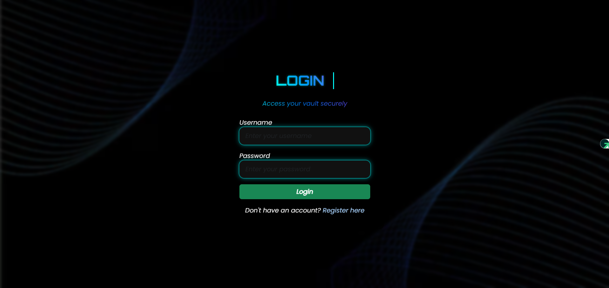
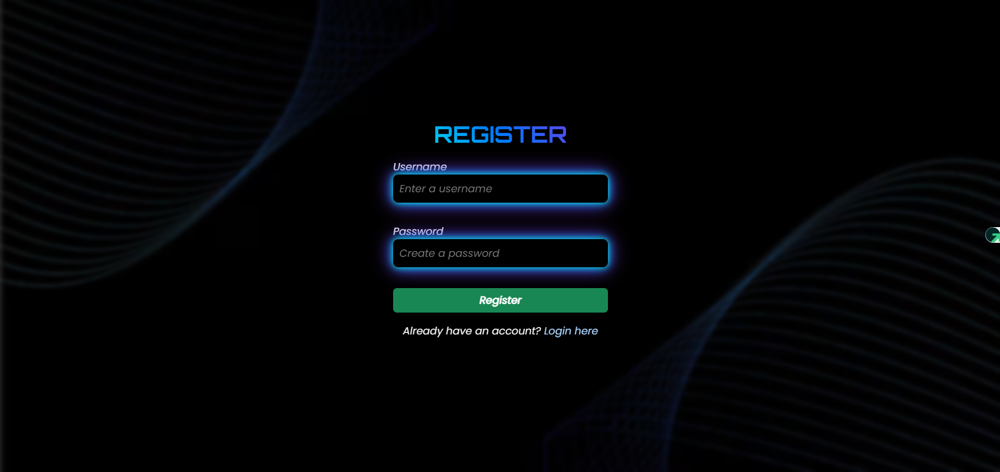
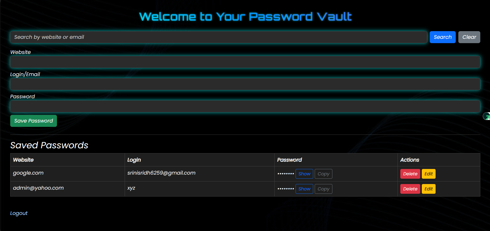

# 🔐 Password Vault

A secure and stylish Flask-based web application to store, manage, and protect your passwords with a futuristic UI and glowing animations.

---

## 📸 Preview





---

## 🚀 Features

- 🔐 User registration and login
- 💾 Save and view website credentials
- 👁️ Show/Hide password toggle
- 📋 One-click Copy to Clipboard
- 🌙 Dark Mode interface (dashboard)
- ✨ Animated UI (login + dashboard + glowing input boxes)
- 🔍 Live search for saved passwords
- 🧼 Clean UX with messages like "No results found"

---

## 🛠️ Tech Stack

- **Backend**: Flask (Python)
- **Frontend**: HTML, CSS, Bootstrap 5, Custom animations
- **Database**: SQLite (lightweight and fast)
- **Version Control**: Git + GitHub

---

## ⚙️ Setup Instructions

```bash
# Clone the repo
git clone https://github.com/your-username/password-vault.git
cd password-vault

# Create virtual environment
python -m venv venv
source venv/bin/activate  # or venv\Scripts\activate (Windows)

# Install dependencies
pip install -r requirements.txt

# Run the app
python app.py


🧪 Development Notes
Default theme: Dark mode

Sensitive variables (if any) should go in a .env file (ignored in .gitignore)

All passwords are stored in plaintext (for demo only) – Use encryption for production

🙌 Credits
Designed and maintained by SrinivasanS